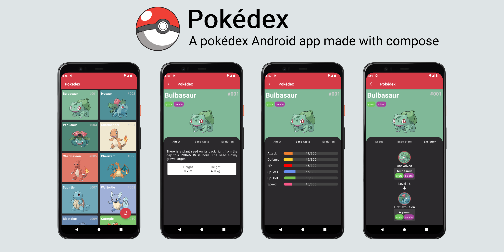

# Pokédex 🔴


**Pokédex** is a sample Android application 📱 built to demonstrate the use of *Jetpack Compose* and *Modern Android development* tools.

***You can Install and test latest Pokédex app from below 👇***

[](https://github.com/paulosabaini/pokedex/releases/latest/download/app.apk)

## About

It loads **Pokémon** data from **PokéAPI** and display it with a simple and clean UI powered by **Jetpack Compose**.

## Built With 🛠
- [Kotlin](https://kotlinlang.org/) - First class and official programming language for Android development.
- [Jetpack Compose](https://developer.android.com/jetpack/compose) - Jetpack Compose is Android’s modern toolkit for building native UI. It simplifies and accelerates UI development on Android. Quickly bring your app to life with less code, powerful tools, and intuitive Kotlin APIs.  
- [Coroutines](https://kotlinlang.org/docs/reference/coroutines-overview.html) - For asynchronous and more.
- [Hilt](https://dagger.dev/hilt/)   - For dependency injection.
- [Retrofit](https://square.github.io/retrofit/) - A type-safe HTTP client for Android and Java.
- [Gson Converter](https://github.com/google/gson) - A Converter which uses Gson for serialization to and from JSON.
- [Coil-kt](https://coil-kt.github.io/coil/) - An image loading library for Android backed by Kotlin Coroutines.
- [Android Architecture Components](https://developer.android.com/topic/libraries/architecture) - Collection of libraries that help you design robust, testable, and maintainable apps.
  - [ViewModel](https://developer.android.com/topic/libraries/architecture/viewmodel) - Stores UI-related data that isn't destroyed on UI changes.
  - [Room](https://developer.android.com/topic/libraries/architecture/room) - SQLite object mapping library.
  - [Paging](https://developer.android.com/topic/libraries/architecture/paging/v3-overview) - The Paging library helps you load and display pages of data from a larger dataset from local storage or over network.
  - [Navigation](https://developer.android.com/guide/navigation) - Navigation refers to the interactions that allow users to navigate across, into, and back out from the different pieces of content within your app.
  - [Palette](https://developer.android.com/training/material/palette-colors) - The palette library is a support library that extracts prominent colors from images to help you create visually engaging apps.
- [Material Components for Android](https://github.com/material-components/material-components-android) - Modular and customizable Material Design UI components for Android.
- [Accompanist](https://github.com/google/accompanist) - Accompanist is a group of libraries that aim to supplement Jetpack Compose with features that are commonly required by developers but not yet available.
- [Floating Action Button Speed Dial](https://github.com/leinardi/FloatingActionButtonSpeedDial) - Android library providing an implementation of the Material Design Floating Action Button Speed Dial.

# Package Structure

    org.sabaini.pokedex  # Root Package
    .
    ├── data             # For data handling
    │   ├── local        # Local Persistence Database. Room (SQLite) database 
    │   └── remote       # Remote Data Handlers
    |
    ├── di               # Dependency Injection
    |
    ├── ui               # View layer
    │   ├── pokedex      # Main screen with the pokémon list
    │   ├── pokemon      # Pokémon detail screen
    │   ├── state        # Ui State models
    │   ├── theme        # App theme
    │   └── viewmodel    # ViewModel classes
    |
    └── utils            # Utility Classes

## Architecture
This app uses the [Android recommended architecture](https://developer.android.com/jetpack/guide) for building robust, high-quality apps.

  

## Open API


Pokedex using the [PokeAPI](https://pokeapi.co/) for constructing RESTful API.<br>
PokeAPI provides a RESTful API interface to highly detailed objects built from thousands of lines of data related to Pokémon.

## License
```
Copyright 2022 Paulo Sabaini

This program is free software: you can redistribute it and/or modify
it under the terms of the GNU General Public License as published by
the Free Software Foundation, either version 3 of the License, or
(at your option) any later version.

This program is distributed in the hope that it will be useful,
but WITHOUT ANY WARRANTY; without even the implied warranty of
MERCHANTABILITY or FITNESS FOR A PARTICULAR PURPOSE.  See the
GNU General Public License for more details.

You should have received a copy of the GNU General Public License
along with this program.  If not, see <http://www.gnu.org/licenses/>.
```
